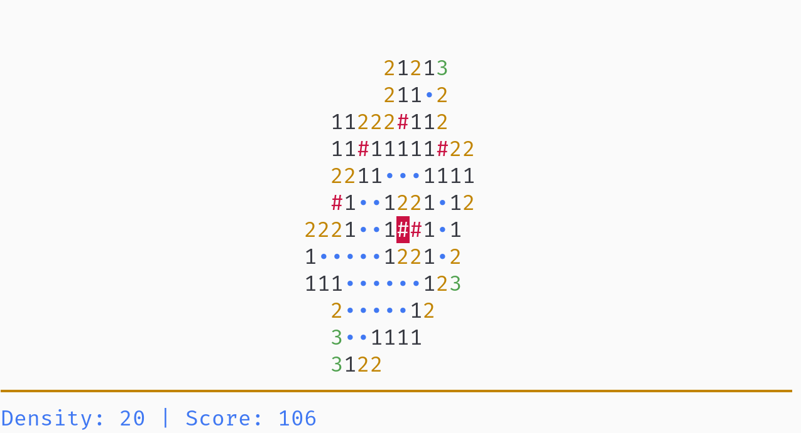

# HaskellSweeper
HaskellSweeper is a clone of the famous [Minesweeper](https://en.wikipedia.org/wiki/Minesweeper_%28video_game%29) game written in Haskell. It features an infinite grid which means that a game could (in theory) go on forever.

This game is played in a terminal using ncurses to render it.



## How to build
### Cabal
The building process has been tested on Ubuntu 14.04 and Linux Mint 17.3:
```sh
sudo apt-get install happy alex libncursesw5-dev libghc-language-c-dev
```
All these dependencies are needed for the ncurses library we are using.
We also need c2hs (but the version in Ubuntu's repos is too old so we'll use cabal to install it instead). If you don't already have cabal: `sudo apt-get install cabal-install && cabal update`
```sh
cabal install c2hs
```
And because by default Ubuntu doesn't have the binaries installed by cabal in the path (you might want to put this in .bashrc, .zshrc or similar):
```sh
export PATH=~/.cabal/bin:$PATH
```

At this point it should be pretty straight forward:
```sh
cabal install --only-dependencies
cabal configure
cabal build
```

### Stack
If you don't have Stack, get it [here](http://docs.haskellstack.org/en/stable/README.html).
The building process has been tested on OSX 10.11:
```sh
stack setup
stack build
```

## How to run the game
### Cabal
```sh
./HaskellSweeper [options]
```

### Stack
```sh
stack exec -- HaskellSweeper [options]
```

With these `options`:

- `auto` -- When placing markers, the cells that are satisfied (number in the cell corresponds to the number of markers around it) will be opened automagically!
- `density n` where `n` is a number between 0 and 100 inclusive. It sets the mine density as a percentage.
- `adventure` -- Play in adventure mode (coming soon)

## How to play
When a cell in the grid is opened it either contains a mine and therefore explodes (Game Over) or will show the player the number of mines in the neighbouring cells (there are 8 neighbouring cells).

- To move around the grid use:
 - Arrow keys (←, ↑, ↓, →)
 - W, A, S, D
 - HJKLYUBN (H - left, J - down, K - up, L - right, Y - up left, U - up right, B - down left, N - down right)
 - Number pad (1 - down left, 2 - down, 3 - down right, 4 - left, 6 - right, 7 - up left, 8 - up, 9 - up right, 5 - mark, 0 - open)
- Press space or 0 to open a cell.
- Press M, E, or 5 to mark a cell (if you think it contains a mine).
- Press Q to quit the game.
- Press R to start a new game.

If an open cell is satisfied (the number of mines the cell indicates matches the number of markers) you can click it (with space) and it will open all the remaining closed cells surrounding it that aren't marked. If you select the `auto` mode this behaviour is completely automated.
